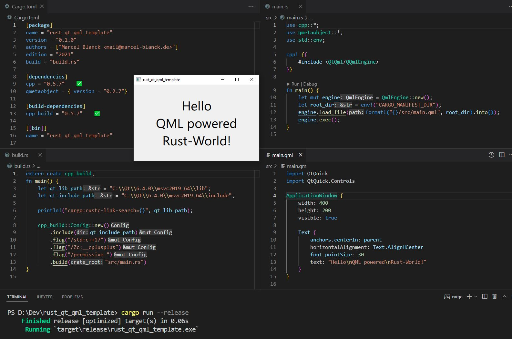

# A Rust Qt/QML Template

A template to run Qt/QML code based on a Rust foundation.

This corresponds to a marriage between the most easy to use, flexible and everywhere performing multi-platform GUI Framework Qt/QML and the fast, reliable, productive and loved Rust Language.

For me Rust with a Qt/QML GUI is the best basis for any project that should combine a great UX with non trivial processing and/or networking under the hood.



## Project Status

- [X] Get QQmlEngine basically running on Windows
- [ ] Demonstrate how to extend QML, e.g. via QObjects
- [ ] Enable QML live update
- [ ] Enable the use of the qt resource system
- [ ] Enable precompiled qml usage
- [ ] Make Windows builds more convenient (no hardcoded paths)
- [ ] Make Project suitable as a GitHub Template repository
- [ ] Support Linux
- [ ] Support MacOS
- [ ] Support Andoid
- [ ] Support iOS
- [ ] Support Web Assembly

## How To Build And Run

### Windows

1. Install the latest stable Rust from: <https://rustup.rs/> (make sure you have C++ build tools installed)
2. Install Qt 6 prebuild for the same msvc version via <https://www.qt.io/download-qt-installer>
3. Make sure the varibales ```qt_lib_path``` and ```qt_include_path``` in the ```build.rs``` file are correct
4. Execute ```cargo run```
